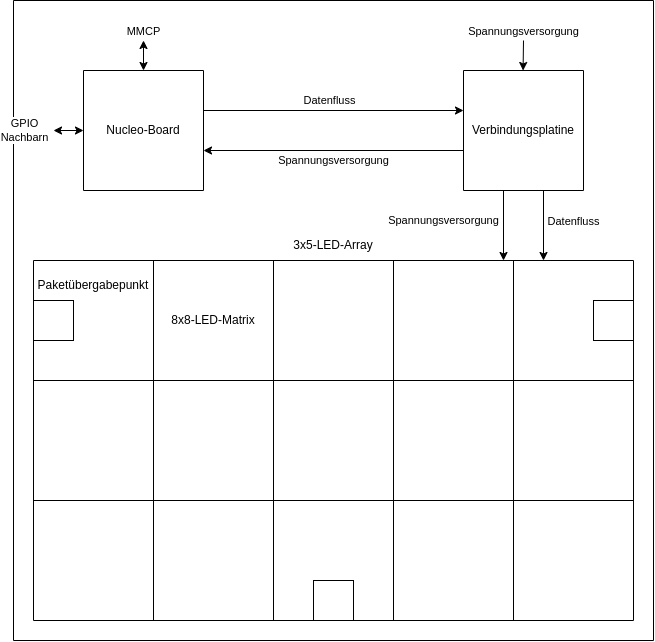
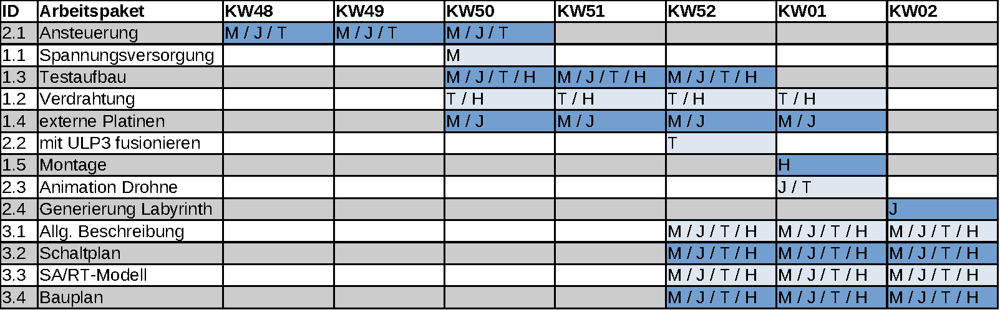

# ES-Projekt

> Hinweis: Nutzt meine [GitHub-Anleitung](https://github.com/sid115/GitHubTutorial) als Hilfestellung. Eine Anleitung zur Syntax von Markdown findet ihr [hier](https://www.markdownguide.org/basic-syntax/).

## Beschreibung
Simulierte Paketdrohne auf Basis des MMCP-Protokolls auf einer LED-Matrix.

## Ordnerstruktur
- [assets](./assets/): exportierte Bilder, PDFs, etc.
- [plans](./assets/): Quelldateien zu Bauplänen, Schaltplänen, etc.
- [src](./src/): Source Code
- [docs](./docs/): Dokumentation

### Projektskizze


## Arbeitspakete

### Hardware
1. Spannungsversorgung
    1. Leistungsanforderungen bestimmen
    1. Geeignetes Netzteil suchen und bestellen
1. Verdrahtung
    - Spannungsversorgung
    - Matrix
    - evtl. Brücken/LED-Streifen
    - evtl. weitere externe Platinen
1. Testaufbau
    1. ULP3 in Standardkonfiguration
    1. Ansteuerung
1. Externe Platinen notwendig?
    - Brücken
    - Spannungsversorgung
    - ...
1. Montage
    1. Matrix
    1. Board
    1. evtl. Brücken/LED-Streifen
    1. evtl. weitere externe Platinen

### Software
1. Ansteuerung
    1. einzelne LEDs
    1. Panel (8x8 LEDs)
    1. Matrix  (3x5 Panele); mehr kaufen möglich?
    1. Implementierung in Schnittstelle
        - `setup()`
            - initialisiert Pins
            - reserviert Speicher
            - Datenstruktur für LEDs initialisieren: `map: (x,y) -> index(LED)`
        - `test()`
            - geht alle LEDs durch und lässt diese der Reihe nach aufleuchten
        - `set(x, y, R, G, B)` 
            - setzt LED an der Stelle (x, y) auf den Wert (R, G, B)
        - `clear()`
            - setzt alle LEDs auf (0, 0, 0)
1. mit ULP3 fusionieren
    1. auf beste Version einigen
    1. implementieren
1. Animation Drohne: Ziel: 5FPS
    1. Größe: 1x1 XOR 3x3
        - 3x3: x: Rotor; p: Paketfarbe
            ```
            x x       x      x x
             p   ->  xpx  ->  p   ->  ...
            x x       x      x x
            ```
        - 1x1: p: Paketfarbe
            ```
             p
            ```
    1. Testen
        1. Direkter Weg (hardcoded): Lager -> Nachbar
        1. Verwinkelter Weg (hardcoded): Lager -> Nachbar
        1. *Optional*: Animation, z.B. pulsierend (1x1), rotierend (3x3)
1. Feld
    1. Generierung Labyrinth
        - Aus vordefinierten Labyrinthen wählen
        - *Optional*: Labyrinth zufällig generieren
        - Ein- bzw. Ausgänge bei Nachbarn definieren
        - LED on: Wand; LED off: Weg
    1. *Optional*: Pathfinding Alg
    1. erweitern durch Brücken oder mehr Panele

### Dokumentation
1. Allg. Beschreibung in Markdown
    - Anforderungen
    - Bibliothek zur Ansteuerung dokumentieren
    - Bedienungsanleitung bzgl. Aufbau und Inbetriebnahme
1. Schaltplan in Eagle
1. Bauplan in Drawio
1. SA/RT-Modell

#### Gliederung
1. Einleitung mit Projektbeschreibung
1. SA/RT Modell mit Erläuterung
1. Hardware miz Schaltplan
    1. LEDs
    1. Nachbar-Pins
1. (Weitere) Software
    1. LED-Ansteuerung
    1. Maze
        1. Generierung
        1. Lösungsalgorithmus
        1. Animation Drohne
1. Résumé (mit Video?)

## Timeline

### Abgabefristen
Datum | Aufgabe
---|---
2023-12-12 | Abgabe ULP3
2023-12-20 | 2. Gruppebesprechung
2024-01-17 | Programm lauffähig
2024-01-24 | Abschluss: gemeinsames Inbetriebnehmen
2024-01-31 | Abgabe src und docs

### Aufgabenverteilung

